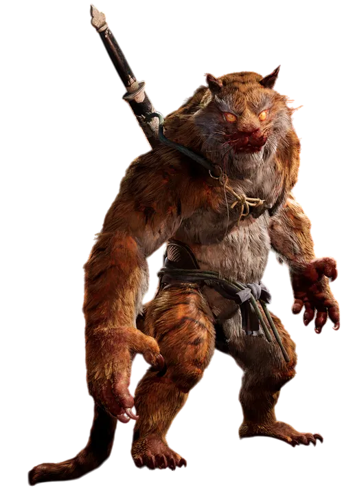
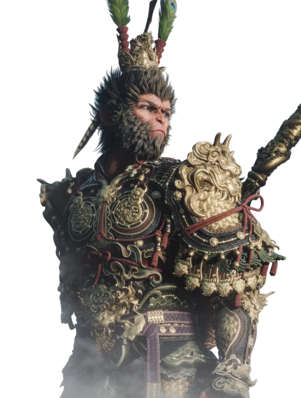

# [검은 신화: 오공] 모작 기획

- 원작: https://store.steampowered.com/app/2358720/Black_Myth_Wukong/
- 문서: https://drive.google.com/drive/folders/1ywouKtkQg_4W45hVxTKPLU7safJd9XiP

## < 구현 기술 >
<table>
  <tr>
    <td width="50%" align="center">
       
      <b>호선봉(보스) - 정하영</b> 
      i. 태권 
      ii. 한손땅 
      iii. 엎드려바위 
    </td>
    <td width="50%" align="center">
       
       <b>오공(플레이어) - 조은정</b> 
      i. 분신술 
      ii. 기화술 
      iii. 정지술 
    </td>
  </tr>
</table>

